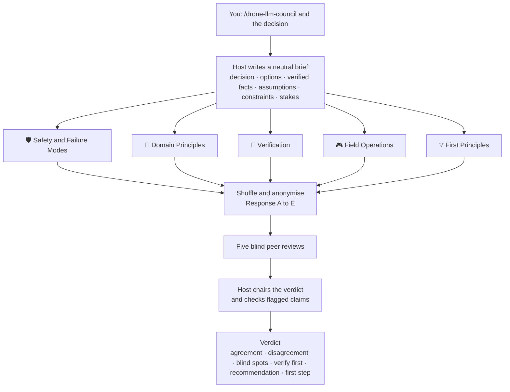

<div align="center">

# 🧭 Drone LLM Council

**Five advisors, one blind peer review, one verdict you can act on.**

A [Claude Code](https://claude.com/claude-code) skill for engineering decisions on drones, PX4 and robots —<br>the kind of decision where a wrong call ends up in the air.

[](LICENSE)
[](https://claude.com/claude-code)
[](#cost-and-models)
[](https://github.com/JeremyHo1123/drone-knowledge-wiki)

</div>

---

## Why a council?

Ask a single assistant "should we do A or B?" and you tend to get an answer that:

- **follows your framing** — the way you asked quietly decides the answer;
- **mixes checked facts with guesses** — and doesn't tell you which is which;
- **forgets the person in the field** — the pilot holding the transmitter when it goes wrong.

The council splits the thinking into five lenses that pull against each other. Every key claim must be tagged `[verified: source]` or `[unverified]`. Then anonymous reviewers hunt for the claims that would flip the conclusion if they were wrong.

**Questions it is good at**

- "When the depth camera stops publishing, should the offboard node hold the last setpoint, switch to Hold, or land?"
- "Should we enter OFFBOARD from Position mode in the air, or let the script arm and take off by itself?"
- "Barometer-corrected altitude or plain EKF altitude for a low hover near buildings?"
- "We changed the takeoff sequence. What must be tested before the next field day?"

**Questions it is not for:** single facts such as "what is the default of `MPC_XY_VEL_MAX`?" Look those up — it's faster and more accurate.

## How it works



1. **Brief.** The host (your main Claude Code session) reads the project's `CLAUDE.md`, the files you mention and any earlier council transcripts, then writes one neutral brief. It contains no opinion of its own.
2. **Advisors.** Five read-only subagents start in the same message, so no answer can influence another. Each one tags its claims and ends with "If I am wrong, it is most likely because: …".
3. **Blind review.** The answers are shuffled into Response A–E. Five reviewers say which is most convincing, which has the biggest blind spot, what everyone missed, and which unverified claims would change the conclusion.
4. **Verdict.** The host chairs. It may side with a minority, checks quick-to-verify claims itself, and is never allowed to recommend skipping a safety step.

## The five advisors

| Advisor | The question it keeps asking | A typical catch |
| --- | --- | --- |
| 🛡️ **Safety & Failure Modes** | What is the worst plausible failure, when does it happen, and what stops it? | A NaN from a sensor becomes a large setpoint jump right at a mode switch |
| 📐 **Domain Principles** | Does this match how the firmware, libraries and physics really behave — in the version on the vehicle? | A parameter that exists in the latest docs but not in the firmware you fly |
| 🧪 **Verification** | How do we prove it before it flies? What passes, what fails, which log fields? | A unit test that passes because it stubs out the exact condition that fails in the field |
| 🎮 **Field Operations** | What does the pilot see and do, under pressure, when it goes wrong? | A switch sequence that is easy to get wrong when the RC override kicks in |
| 💡 **First Principles** | What problem are we really solving? Is there a simpler move? | One parameter change instead of a new ROS node |

The tensions are deliberate. Safety adds guards while First Principles cuts complexity. Domain Principles says what is correct while Field Operations says what is doable. Verification asks everyone for evidence.

## Install

The skill is a single folder. Copy it into your personal skills directory to use it in every project:

**macOS / Linux**

```bash
git clone https://github.com/JeremyHo1123/drone-llm-council.git
mkdir -p ~/.claude/skills
cp -r drone-llm-council/skills/drone-llm-council ~/.claude/skills/
```

**Windows (PowerShell)**

```powershell
git clone https://github.com/JeremyHo1123/drone-llm-council.git
New-Item -ItemType Directory -Force "$HOME\.claude\skills" | Out-Null
Copy-Item -Recurse drone-llm-council\skills\drone-llm-council "$HOME\.claude\skills\"
```

To use it in one project only, copy the folder into that project's `.claude/skills/` instead. Start a new Claude Code session afterwards so the skill is picked up.

## Usage

The skill only starts when you ask for it explicitly:

```text
/drone-llm-council When the depth camera stream drops for more than 0.5 s, should our offboard node switch PX4 to Hold or land immediately?
```

Other phrases that start it: "council this", "run the council", "convene the council".

| You want | Say |
| --- | --- |
| A cheaper first pass | Add **"quick"** — the blind review is skipped (5 subagents instead of 10) |
| Advisors to check real code | Name the files: "see `src/offboard_node.py` and `notes/flight-12.md`" |
| A record for later | Add **"save the transcript"** → `discussions/YYYY-MM-DD-council-<topic>.md` |

The verdict comes back in your language, in a fixed structure:

```markdown
## Council verdict: <topic>

### Where the advisors agree
### Where they disagree
### Blind spots found in review
### Verify before deciding
### Recommendation
### First step
```

The **First step** is always one concrete, small, reversible action. If it touches hardware, it is phrased as "ask for permission to …".

## Cost and models

| Mode | Subagents | Use it when |
| --- | ---: | --- |
| Full | 10 (5 advisors + 5 reviewers) | The change will fly, or will touch hardware |
| Quick | 5 (advisors only) | Early exploration, low stakes |

- The chair is your main session, not an extra subagent.
- In Claude Code, subagents run on the main conversation's model unless you configure otherwise. To run them on a cheaper model, set the environment variable `CLAUDE_CODE_SUBAGENT_MODEL` (for example `sonnet`) before starting Claude Code.
- A full council is roughly ten extra long-context model runs, so keep it for decisions that deserve it.

## Pair it with Drone Knowledge Wiki

A council is only as good as the facts in its brief. Five advisors on the same model share the same blind spots about parameter names, defaults and version differences.

[**Drone Knowledge Wiki**](https://github.com/JeremyHo1123/drone-knowledge-wiki) gives them something real to check against:

- 1,075 pages of official PX4, QGroundControl and MAVSDK-Python documentation, stored as Markdown
- a routing index for each doc set, plus a Chinese–English glossary
- concept and how-to pages that connect the three doc sets

Run the council from inside that folder. The brief then lists the relevant documentation pages, and advisors can tag claims as `[verified: raw/documents/PX4/…]` instead of relying on memory.

```bash
git clone https://github.com/JeremyHo1123/drone-knowledge-wiki.git
cd drone-knowledge-wiki
claude
```

```text
# 1. Gather the facts
/docs-query What does PX4 do when the offboard setpoint stream stops, and which parameters control it?

# 2. Decide with the council
/drone-llm-council Our companion computer could crash mid-flight. Should we rely on PX4's offboard-loss failsafe, or add our own watchdog that switches to Hold?
```

## Safety notes

- **Advice, not certification.** A verdict is a structured second opinion. Simulation, props-off tests, tethered tests and your own judgement still decide what flies.
- **Same model, same blind spots.** For any change that will fly, the verdict tells you to get the brief reviewed by a model from a different vendor, or by a person.
- **Your project's rules win.** Advisors are told to respect the safety rules in your `CLAUDE.md` (for example "ask before arming"). The chair may never recommend skipping a step those rules require.
- **Read-only advisors.** Advisors and reviewers may read files. They may not edit files, connect to other machines or run commands that change state.

## Credits

- **Method** — Andrej Karpathy's [llm-council](https://github.com/karpathy/llm-council): independent answers, anonymous peer review, a chairman's synthesis.
- **Inspiration** — [aiwithremy/claude-skills-llm-council](https://github.com/aiwithremy/claude-skills-llm-council) by Ole Lehmann, which first packaged the idea as a single Claude Code skill.

This repository is an independent rewrite for engineering work: different advisors, verification tags, read-only fact checking, a host-chaired verdict and built-in safety rules.

## License

[MIT](LICENSE) © 2026 JeremyHo1123
